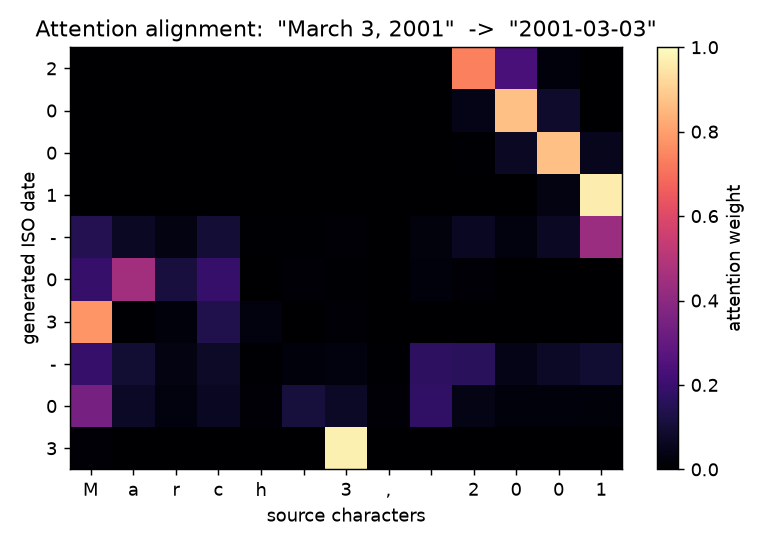

# Neural machine translation with attention

A from-scratch tutorial implementation of a sequence-to-sequence translator with
Bahdanau (additive) attention, in PyTorch. The point of this repository is to
show, component by component and with the math alongside the code, how attention
lets a decoder align its output with the source. It is demonstrated on a
controlled task where that alignment is directly visible: normalizing
human-written dates into ISO 8601.

The narrated walkthrough in `notebooks/demo.ipynb` is the primary entry point.
The sections below mirror it.

## Why attention

A plain sequence-to-sequence model encodes the whole source into one fixed-length
vector and asks the decoder to produce every output token from that single
summary. The summary is a bottleneck. Attention removes it: the encoder keeps one
hidden state per source position, and at every output step the decoder builds a
fresh, weighted summary that focuses on the source positions that matter right
now.

Concretely, the model has three parts.

**Encoder.** A bidirectional GRU reads the source characters and returns one
state per position, `h_1, ..., h_S`, each of dimension `2H` (forward and backward
concatenated). Nothing is compressed away; every position is kept.

**Bahdanau attention.** At a decoding step with state `s`, a small feed-forward
network scores each source position,

```
e_j = v^T tanh(W_enc h_j + W_dec s)
```

padded positions are masked to negative infinity, a softmax turns the scores into
weights that sum to one, and the context vector is the weighted average of the
encoder states,

```
alpha = softmax(e),    c = sum_j alpha_j h_j
```

The weights `alpha` are the alignment. Plotted as a heatmap they show, for each
output character, which source characters the decoder leaned on.

**Decoder.** A GRU cell consumes the previous output embedding together with the
context vector, updates its state, and projects the state-and-context pair to
logits over the target vocabulary. Training uses teacher forcing; inference uses
greedy autoregressive decoding through the identical step function.

The full derivation, with masking and the interpretability argument, is in
[`docs/attention.md`](docs/attention.md). The equations there map one to one onto
`src/nmt/model.py`.

## The controlled task

The source is dates written the way people write them, across six formats. The
target is the canonical `YYYY-MM-DD`. This is a real alignment problem: the model
must copy the year digits, map a month name to two digits, copy the day, and
reorder the three fields. It is fully synthetic, generated deterministically by
`nmt.data.make_date_dataset`, so there is no download and the run reproduces
exactly.

```
Jul 2, 1990          -> 1990-07-02
06.03.1978           -> 1978-03-06
28th of August 2012  -> 2012-08-28
February 22, 2006    -> 2006-02-22
```

## The hero figure: learned alignment



Each row is one generated output character, each column one source character, and
brightness is the attention weight. The year digits attend to the source year,
the month digits to the month name, and the day digits to the source day. The
matrix reads almost like a permutation, which is exactly the alignment the
additive attention mechanism is meant to learn. Regenerate it from the committed
model with:

```bash
python scripts/translate.py --heatmap "March 3, 2001"
```

## Results, and an honest reading of them

Trained on 10800 generated date pairs (1200 held out), 15 epochs, single CPU,
seed 0, produced by `scripts/train.py` in this session:

| Metric                    | Value  |
|---------------------------|-------:|
| Test exact-match accuracy | 1.0000 |
| Test BLEU (character)     | 1.0000 |

Every held-out date across all six formats is normalized correctly. This is not a
machine-translation benchmark and should not be read as one. The date task is
synthetic, finite in structure, and fully learnable on a CPU, so a correctly
implemented attention model is expected to solve it completely. The value of the
perfect score is as controlled validation: it confirms the encoder, attention,
masking, decoder, and greedy decoder are wired correctly, and the heatmap
confirms the model succeeds by aligning source and target rather than by a
shortcut. The same architecture applies unchanged to a natural-language parallel
corpus such as Multi30k, where scores would be far lower and beam search and
subword tokenization would begin to matter. The numbers above are written to
`results/metrics.json`.

## Quickstart, no training, no network

A small trained checkpoint is committed at `models/date_translator.pt` (under
1 MB), so translation and the heatmap render instantly offline.

```bash
python -m venv .venv && source .venv/bin/activate   # Windows: .venv\Scripts\activate
pip install torch --index-url https://download.pytorch.org/whl/cpu
pip install -e ".[dev]"

# Normalize dates with the committed model (no training, no download):
python scripts/translate.py "March 3, 2001" "07.06.1994"
python examples/translate_examples.py
```

## Reproduce the training run

```bash
python scripts/train.py --n 12000 --epochs 15
```

This regenerates the checkpoint, `results/metrics.json`, the attention heatmap,
and the loss curve. Open `notebooks/demo.ipynb` for the narrated derivation and
run it end to end in about two minutes on a CPU.

## Layout

```
src/nmt/        data, model (encoder, attention, decoder, seq2seq),
                train, metrics, checkpoint (save/load), viz (heatmap, translate)
scripts/        train.py, translate.py (offline), make_sample.py, download_data.py
notebooks/      demo.ipynb (executed, primary entry point)
docs/           attention.md (the derivation)
examples/       translate_examples.py + README, offline
models/         date_translator.pt (committed pretrained checkpoint)
data/           sample_dates.csv (synthetic sample) + README; full data gitignored
results/        attention.png (hero), loss.png, metrics.json
tests/          pytest suite for data, model shapes, attention, checkpoint,
                alignment, metrics, training
```

## What it does not do

- The headline demo is a controlled date task, chosen so the full attention
  pipeline is verifiable end to end on a CPU. It is not trained on a natural
  language corpus here, though the code is corpus-agnostic (see
  `scripts/download_data.py` and `data/README.md`).
- Decoding is greedy, not beam search.
- Tokenization is character level, not subword.

## Tests

```bash
pytest -q
ruff check src tests scripts
```

## License

MIT, see [LICENSE](LICENSE).

## Author

Aamir Malik. [GitHub](https://github.com/aamirmalik-dr) ·
[LinkedIn](https://linkedin.com/in/dr-aamirmalik)
